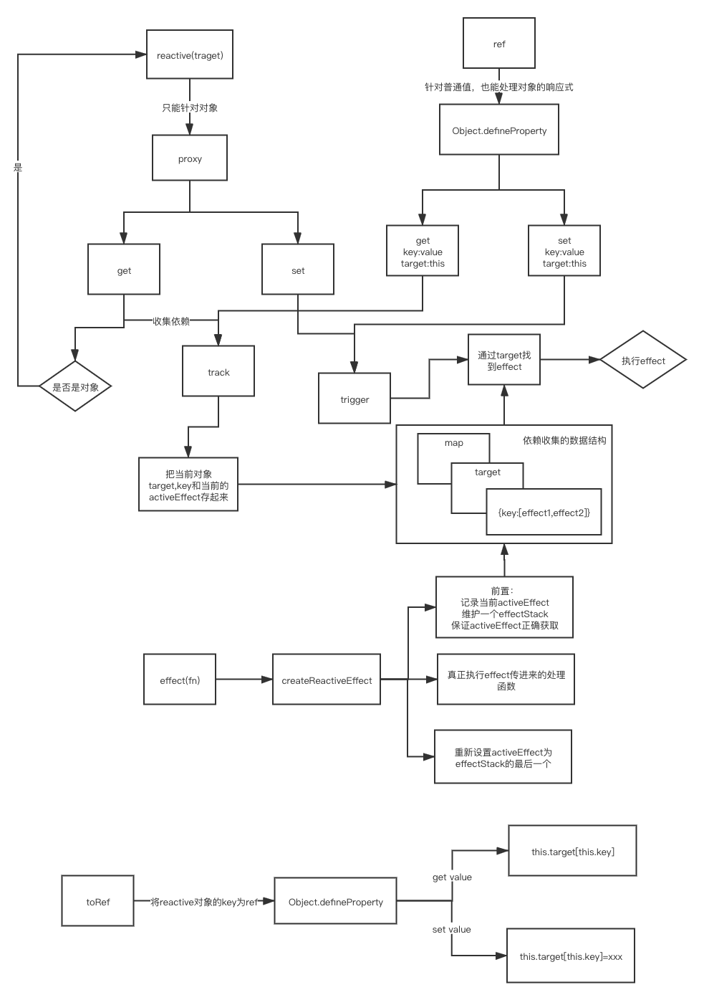

# 实现vue3

- Reflect.get和普通的对象取值的差别

## 食用方法

```shell
git clone https://github.com/xuxiaozhou/my-vue3
yarn install
yarn build

# demo代码 packages/**/example
```

## reactive

### reactive/ref/effect的实现原理



### 编译过程

```
https://vue-next-template-explorer.netlify.app/
```

- 先将模板进行分析，生成ast树
- 转换transform -> 对动态节点做一些标记
- 代码生产 codegen

### block -> block tree

- diff算法，递归遍历，属于全量比对
- block的作用就是为了收集动态节点
- 在createVnode的时候判断是动态节点后让外层的block进行收集
- 目的是在diff
- 会标记为block
  - 会影响结构的  v-if  
  - 序列不稳定 v-for  不收集动态节点
- 父会收集儿子block -> blockTree（多个）

### patchFlags 对不同的动态节点进行描述

## 性能优化

- 静态提升
- 事件
  - 缓存事件，防止重新创建事件
- template和jsx
  - template简单（模板编译优化）
  - jsx灵活（没有模板编译优化）
- proxy -> defineProperty
  - 懒递归
- vue3 diff算法（可以根据patchFlag做diff）和vue2（全量diff）
  - vue3最长递增子序列
- 写法
  - vue2： options API
  - vue3: compositeion API
- Fragment
- Teleport
- Suspense
- ts支持
- 自定义渲染器 createRenderer
- monorepo源码管理
- 模板编译优化
