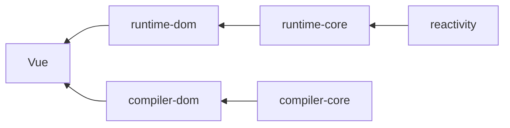
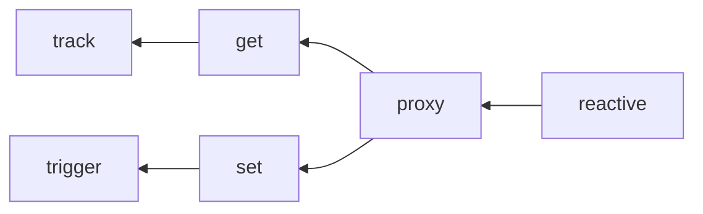

# 手写vue3

> 在线地址：https://github.com/xuxiaozhou/my-vue3

## Vue3目录介绍

- packages 
  - reactivity: 响应式
  - runtime-core: 运行时核心
  - runtime-dom: DOM环境的运行
  - shared: 公共函数
- scripts： 脚本
- rollup.config.js: rollup编译文件
- tsconfig.json:

## 包的关系



## reactivity

### 响应式api

| api             | 作用   | dep  |
| --------------- | ------ | ---- |
| reactive        | 响应式 | 深层 |
| readonly        | 只读   | 深层 |
| shallowReactive | 响应式 | 浅层 |
| shallowReadonly | 只读   | 浅层 |




### API

- 通过高阶函数，只需要传入深浅层和对应的proxy的get,set处理即可实现4个方法

```ts
export function reactive<T = object>(obj: T) {
  return createReactiveObject(obj, false, reactiveHandler);
}

// 对象的任何层都只读
export function readonly<T = object>(obj: T) {
  return createReactiveObject(obj, true, readonlyHandler);
}

// 对象的浅层响应式，深层不响应
export function shallowReactive(obj) {
  return createReactiveObject(obj, false, shallowReactiveHandler);
}

// 对象的浅层只读，深度只读
export function shallowReadonly(obj) {
  return createReactiveObject(obj, true, shallowReadonlyHandler);
}
```

### createReactiveObject

- 都是采用proxy代理响应式
- 只能代理对象
- 通过reactiveMap和readonlyMap的防止重复代理
- 使用weakMap的作用可以在target被销毁是，weakMap能够同时垃圾回收

```ts
// 缓存已经处理过的对象：在target销毁时能被垃圾回收
const reactiveMap = new WeakMap();
const readonlyMap = new WeakMap();

function createReactiveObject(target, isReadonly, baseHandlers) {
  // 只能处理是对象类型
  if (!isObject(target)) {
    return target;
  }

  const map = isReadonly ? readonlyMap : reactiveMap;

  if (map.has(target)) {
    // 返回已经缓存
    return map.get(target);
  }

  const proxy = new Proxy(target, baseHandlers);
  map.set(target, proxy);

  return proxy;
}
```

### handlers

- 主要是实现4个api不同的get和set
- 封装get和set高阶函数，可以传入不同参数

```ts
export const reactiveHandler = {
  get: createGet(),
  set: createSet(true)
};

export const shallowReactiveHandler = {
  get: createGet(false, true),
  set: createSet(true)
};

// readonly的设置都返回报错
export const readonlyHandler = {
  get: createGet(true),
  set: () => {
    console.log('error');
  }
};
export const shallowReadonlyHandler = {
  get: createGet(true, true),
  set: () => {
    console.log('error');
  }
};
```

### createGet

- 创建handler的get
- track的作用是此对象和此属性收集依赖

```ts
/**
 * createGet
 * @param isReadonly 是否只读
 * @param shallow 是否浅层
 * @returns function
 */
function createGet(isReadonly = false, shallow = false) {
  return function (target, key, receiver) {
    // 类比 target[key]
    const result = Reflect.get(target, key, receiver);

    if (!isReadonly) {
      // 非只读，需要收集依赖
      track(target, key, TrackOptType.GET);
    }

    if (shallow) {
      // 浅层的就结束
      return result;
    }

    // 如果是对象，且非浅层的，还是继续递归调用readonly和reactive
    if (isObject(result)) {
      return isReadonly ? readonly(result) : reactive(result);
    }

    // 非对象就直接返回
    return result;
  };
}
```

### createSet

- 设置会判断操作类型：新增或修改
  - 新增：
    - 对象：设置的key不是对象本身已有的属性
    - 数组：key为索引，且索引值大于数组本身长度
  - 修改：新旧值不一样则是修改
- trigger：通知依赖触发更新操作

```ts
/**
 * 创建set
 * @param shallow 是否浅层
 * @returns 
 */
function createSet(shallow = false) {
  return function (target, key, value, receiver) {
    // 获取原来值
    const oldValue = Reflect.get(target, key);

    // 设置后会返回一个是否成功
    const result = Reflect.set(target, key, value, receiver);

    /**
     * 新增
     *    数组：并且设置索引，并且设置的索引比当前数组的长度还长
     *    对象：设置的key不是对象本身已有的属性
     * 修改
     *    新旧值不一样则是修改
     */
    const hasKey = isArray(target) && isInteger(key)
      ? Number(key) < target.length - 1
      : hasOwn(target, key);

    if (!hasKey) {
      // 通知：新增操作
      trigger(target, TriggerOpt.ADD, key, value);
    } else if (hasChanged(oldValue, value)) {
      // 通知：修改操作
      trigger(target, TriggerOpt.SET, key, value, oldValue);
    }

    // 返回修改结果
    return result;
  };
}
```

### 了解effect

> 在了解trigger和track之前，先了解effect

其作用：默认会执行一次，在effect执行函数用到的响应式变量（reactive,readonly,shallowReactive,shallowReadonly,ref,shallowRef包装过）会被收集依赖，当这边变量发生变化是会再次执行此函数

```js
const state = reactive({ hello: 'world', other: 1 })

// 默认会执行此函数fn
effect(()=>{  // fn
  // 使用累reactive包装后的变量
  app.innerHTML = state.hello
})

setTimeout(() => {
  state.hello = 'vue'
  // 修改后会默认调用fn函数
}, 1000);
```

### effect：副作用

```ts
export function effect(fn, options: EffectOptions = {}) {
  // 创建响应式
  const effect = createReactiveEffect(fn, options);

  // 如果没有设置lazy，会立即执行一次
  if (!options.lazy) {
    effect();
  }

  return effect;
}
```

### createReactiveEffect：创建响应式副作用

```ts
// 存放当前的effect，方便track将target，key和对应的effect关联起来
let activeEffect;
// 存放一个栈形结构，保证activeEffect指向正确
const effectStack = [];

let uid = 0;
function createReactiveEffect(fn, options) {
  const effect = function createEffect() {
    // 保证不再重复
    if (!effectStack.includes(effect)) {
      try {
        effectStack.push(effect);
        activeEffect = effect;
      
        // 其实还是调用传进来的函数
        return fn();
      } finally {
        // 保证effect永远正确
        effectStack.pop();
        activeEffect = effectStack[effectStack.length - 1];
      }
    }
  };

  effect.id = uid++;
  effect.__isEffect = true;
  effect.raw = fn;
  effect.options = options;

  return effect;
}
```

### 存在effectStack的原因

```js
effect(()=>{  // effect1
  state.name =1
  effect(()=>{  // effect2
    state.age=2
  })
  state.address=3   // 此处应该存effect1，如果没有当一个effect执行完后重制为数组最后一个，此时存的就是effect1
})
```

### track: 收集依赖

> 对象，key和effect需要关联起来

```ts
/**
 * 收集依赖，将target,key关联起来
 * @param target 对象
 * @param key  属性
 * @param type 类型
 * @returns 
 */
export function track(target, key, type) {
  // 此处的activeEffect是跟effect在同一文件。
  // 主要利用js是单线程的机制
  // 如果当前使用值不在effect里面使用是不需要收集
  if (!activeEffect) {
    return;
  }

  /***
  存储的数据结果
  Weakmap {
    [ target ]: Map {
      [ key ] : Set [ effect1, effect2 ]
    }
  }
  */
  let depsMap = targetMap.get(target);
  if (!depsMap) {
    depsMap = new Map();
    targetMap.set(target, depsMap);
  }

  let depMap = depsMap.get(key);
  if (!depMap) {
    depMap = new Set();
    depsMap.set(key, depMap);
  }

  const dep = depMap.has(activeEffect);
  if (!dep) {
    depMap.add(activeEffect);
  }
}
```

### trigger: 触发更新

- 通过target获取此对象收集的依赖
- 修改数组长度
  - 触发收集length的effect
  - 触发收集索引大于length的effect
- 修改
  - 触发收集对应key的effect
- 如果是数组，且是新增操作
  - 触发收集length的effect

```ts
/**
 * 触发更新
 * @param target 对象
 * @param type 更新类型
 * @param key 属性
 * @param newValue 新值
 * @param oldValue 旧值
 * @returns 
 */
export function trigger(target, type, key: string, newValue?, oldValue?) {
  // 此对象没被依赖收集就不需要处理
  const depsMap = targetMap.get(target);
  if (!depsMap) {
    return;
  }

  // 要执行的effect存到新的集合
  const effects = new Set();
  const add = (effectToAdd) => {
    if (effectToAdd) {
      effectToAdd.forEach(effect => {
        effects.add(effect);
      });
    }
  };

  // 修改数组的长度
  if (isArray(target) && key === 'length') {
    depsMap.forEach((dep, key) => {
      // 更改长度
      // length收集的effects要执行
      // 大于新设置长度的索引收集的effects也要执行
      if (key === 'length' || (isNumber(key) && Number(key) > newValue)) {
        add(dep);
      }
    });
  } else {
    if (key !== undefined) {
      // 修改
      add(depsMap.get(key));
    }

    switch (type) {
      case TriggerOpt.ADD:
        // 数组：新增操作，length收集的effects要执行
        if (isArray(target) && isInteger(key)) {
          add(depsMap.get('length'));
        }
    }
  }

  // 要执行的effects依次执行
  effects.forEach((effect: any) => {
    // effect不一定都是立即执行的，可能做一下其他事情，比如computed
    if (effect.options?.scheduler) {
      effect.options.scheduler(effect);
    } else {
      effect();
    }
  });
}
```

## ref

### 使用

```ts
const name = ref('hello')
const age = ref({ num: 10 })

effect(() => {
  app.innerHTML = name.value + '---' + age.value.num
})

setTimeout(() => {
  name.value = 'world'
}, 1000);

setTimeout(() => {
  age.value.num = 20
}, 2000);
```

### 特点

- 针对reactive等不支持对象的形式支持
- 支持除了普通类型也是支持引用类型
- 使用`.value`

### ref/shallowRef

```ts
// 传进来的是普通值
export function ref(value: string | number | boolean | object) {
  return createRef(value);
}

// 传进来的是普通值
export function shallowRef(value) {
  return createRef(value, true);
}
```

## createRef

```ts
function createRef(value, isShallow = false) {
  return new RefImpl(value, isShallow);
}

// 如果是对象则采用reactive
const convert = val => isObject(val) ? reactive(val) : val;

class RefImpl {
  // 存放处理过的值
  public _value;
  // 存放原值
  public _rawValue;
  private isShallow;
  // 增加标示
  public _v_isRef = true;

  public constructor(value, isShallow) {
    // 如果是深度且是对象，只用reactive去处理响应式
    this._value = isShallow ? value : convert(value);
    // 保存原值
    this._rawValue = value;

    this.isShallow = isShallow;
  }

  get value() {
    // 跟reactive一样收集依赖
    track(this, 'value', TrackOptType.GET);
    return this._value;
  }

  set value(newValue) {
    if (hasChanged(newValue, this._rawValue)) {
      this._rawValue = newValue;
      this._value = this.isShallow ? newValue : convert(newValue);
      // 触发修改：修改操作
      trigger(this, TriggerOpt.SET, 'value', newValue, this._value);
    }
  }
}
```

